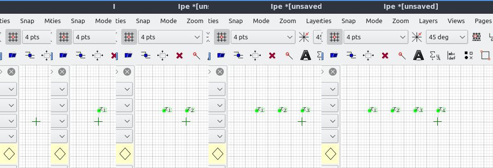
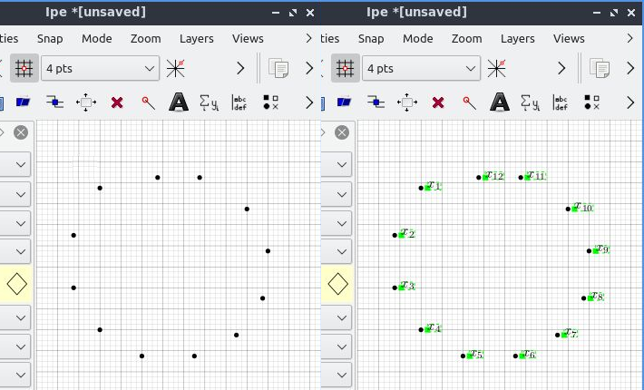
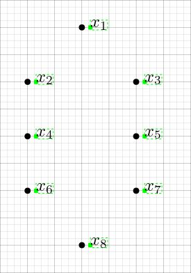
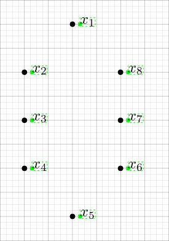

# Automatic Labelling for IPE

[IPE](http://ipe.otfried.org/) is an extensible drawing editor software specially targeted at making figures for inclusion into LaTeX documents, as well as multi-page PDF presentations.

This repository contains a small extension of IPE, a so-called _ipelet_. The ipelet in this repository automatizes the repetitive task of manual edition of objects' labels. It offers single, free addition of labels, and also addition of multiple labels attached to several objects.

- Single, free addition of labels: add labels one by one while being able to choose their position in the page freely.

- Multiple addition: select several objects in your document and add the labels next to them in an orderly fashion.

## How to use it

Labels of objects added are formatted using an internal counter which increases one unit for every added label. Users of this ipelet can format labels themselves using a string, referred to as "labelling expression", whose syntax is flexible enough to allow arithmetic expressions that contain references to this counter. The counter is referenced using ``^L``.

For example:

- The labelling expression ``$x_{%% ^L %%}$`` produces an ``x`` with a subscript that contains the value of the counter. Since it starts at 1, the subscripts generated are the natural numbers,

- ``%% ^L*^L %%`` produces the squares of the natural numbers,

- ``%%^L%%/100`` produces the typical "x out of 100": ``x/100``,

- and, similarly, ``This is object number %%^L%%. Its associated variable is $x_{%%^L%%}$`` the ``%%^L%%`` are replaced by the value of the counter.

More generally, any labelling expression can contain several chunks of ``%%``-delimited strings (inbetween arbitrarily long senteces) within which arithmetic expressions making references to ``^L``   are allowed. A labelling expression is legal when it has ``%%``-strings correctly delimited (as a rule of the thumb, it must have an even number of ``%%``), and the contents within ``%%``-strings comply with LUA's format of arithmetic expressions. This means that besides the usual arithmetic expressions using ``+``,``-``,``*``,``/`` and ``^`` one can also include trigonometric functions (e.g., ``sin``, ``cos``, ...), logarithms (``log``), square root (``sqrt``), and so on.

Users are strongly encouraged to add custom shortcuts to IPE so that this ipelet can be used comfortably. My particular suggestion is
    
    -- assign a shortcut to modifying the labelling expression
    ipelet_1_automatic_labelling = "Ctrl+D",
    
    -- assign a shortcut to the action of labelling objects
    ipelet_2_automatic_labelling = "Ctrl+Alt+D",

### Adding a label

Click on ``Ipelets`` > ``Automatic labelling`` > ``Make label`` (or use the shortcut) in order to generate a new label. Users willing to label several objects in one click must be aware that objects are labelled in the same order they were introduced into IPE. Objects must be selected prior to making the labels.

### Setting a custom labelling expression

Click on ``Ipelets`` > ``Automatic labelling`` > ``Set labelling expression`` (or use the shortcut) in order to introduce a custom labelling expression into IPE.

### Resetting the label counter

In order to set the label counter back to 0, simply click on ``Ipelets`` > ``Automatic labelling`` > ``Reset label counter``.

### Set label geometry

Labels associated to objects are usually placed near the corresponding object, by an offset of ``x=5`` and ``y=0`` by default. This can be changed by clicking on ``Ipelets`` > ``Automatic labelling`` > ``Set label geometry``. 

## Installation

Copy the file [automatic_labelling.lua](https://github.com/lluisalemanypuig/autolabipe/blob/master/automatic_labelling.lua) to your ``~/.ipe/ipelets`` or other directory for ipelets.

## History of changes

### 31st May 2020

Created repository
